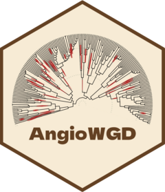

<!-- README.md is generated from README.Rmd. Please edit that file -->

```{r, include = FALSE}
knitr::opts_chunk$set(
  collapse = TRUE,
  comment = "#>",
  fig.path = "man/figures/README-",
  out.width = "100%"
)
```

# AngioWGD 

<!-- badges: start -->
[](https://lifecycle.r-lib.org/articles/stages.html#stable)
[](https://app.codecov.io/gh/almeidasilvaf/AngioWGD?branch=main)
[](https://github.com/almeidasilvaf/AngioWGD/actions/workflows/R-CMD-check.yaml)
<!-- badges: end -->

__AngioWGD__ is an R package that contains a Shiny app where users can explore
whole-genome duplication (WGD) events in angiosperms, their dates, and 
phylogenetic positions.

## Installation

You can install the released version of __AngioWGD__ from GitHub with:

```{r eval = FALSE}
remotes::install_github("almeidasilvaf/AngioWGD")
```

## Code of Conduct

Please note that the __AngioWGD__ project is 
released with a [Contributor Code of Conduct](https://contributor-covenant.org/version/2/0/CODE_OF_CONDUCT.html). 
By contributing to this project, you agree to abide by its terms.

