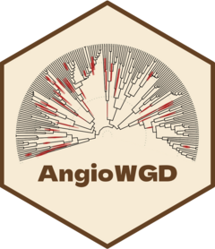

<!-- README.md is generated from README.Rmd. Please edit that file -->

# AngioWGD 

<!-- badges: start -->

[](https://lifecycle.r-lib.org/articles/stages.html#stable)
<!-- badges: end -->

**AngioWGD** is an R package that contains a Shiny app where users can
explore whole-genome duplication (WGD) events in angiosperms, their
dates, and phylogenetic positions.

## Installation

You can install the released version of **AngioWGD** from GitHub with:

``` r
remotes::install_github("almeidasilvaf/AngioWGD")
```

## Code of Conduct

Please note that the **AngioWGD** project is released with a
[Contributor Code of
Conduct](https://contributor-covenant.org/version/2/0/CODE_OF_CONDUCT.html).
By contributing to this project, you agree to abide by its terms.
